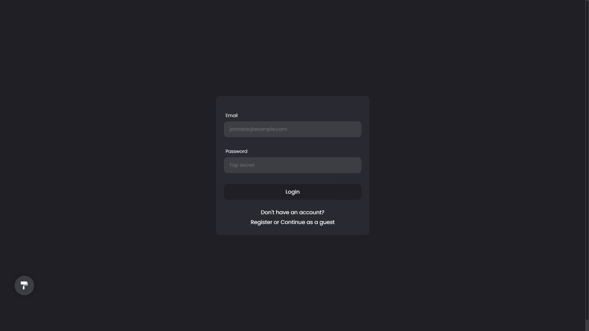
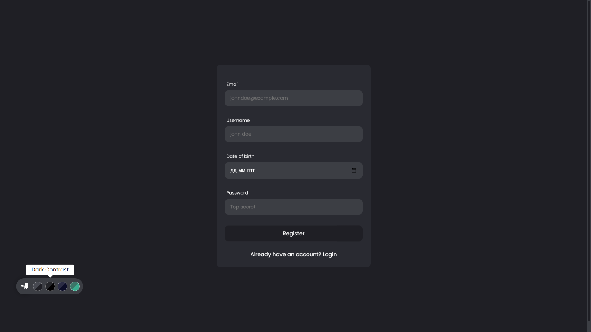
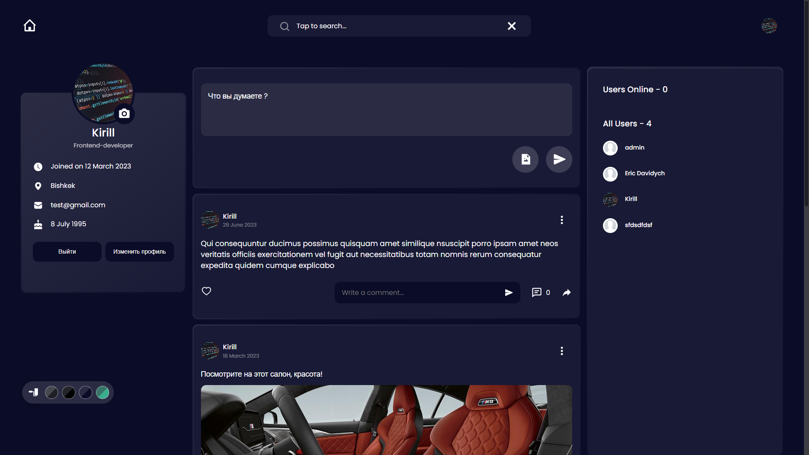
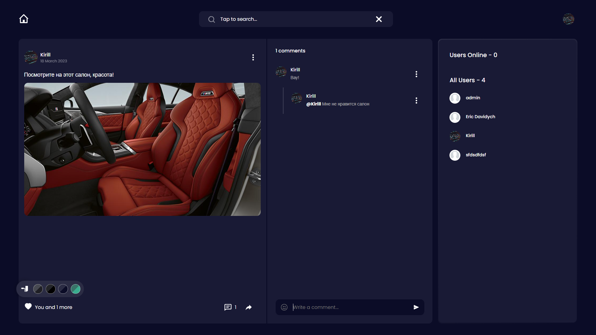
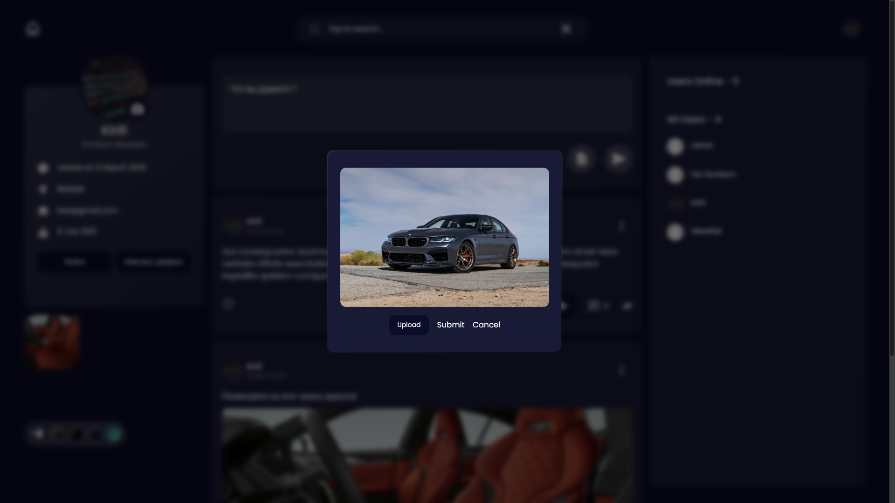

# Социальная сеть "Sotnikov". Лучшие посты у нас.

SPA приложение с клиент-серверной архитектурой.

1. Разработал Авторизацию/Регистрацию, JWT.
2. Возможность оставить отзыв, система лайков и тд.

# Запуск проекта локально(временное решение) 🔥🔥🔥

```
Открывать на порту http://localhost:3000/

cd client -> npm start
cd server -> npm run serve
```

# Стек технологий

-   React, javaScript
-   React-Redux, Redux Toolkit
-   NodeJS, Express, MongoDB


# Реализовано









